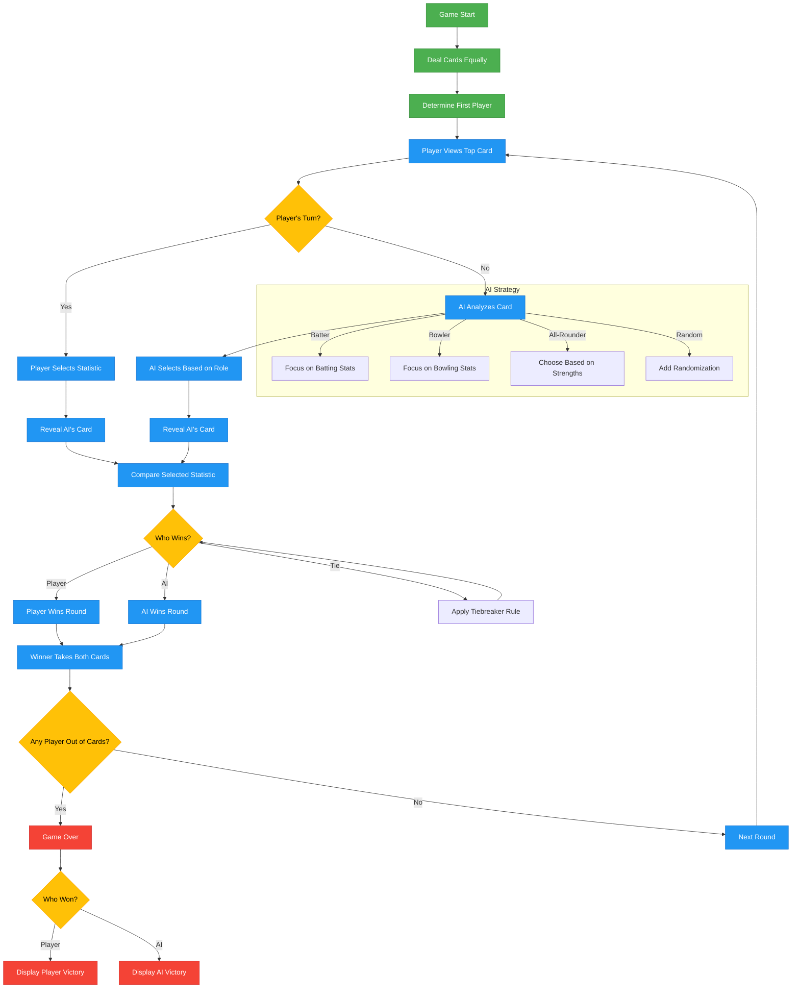

```mermaid
flowchart TD
    A[Game Start] --> B[Deal Cards Equally]
    B --> C[Determine First Player]
    C --> D[Player Views Top Card]
    
    D --> E{Player's Turn?}
    E -->|Yes| F[Player Selects Statistic]
    E -->|No| G[AI Analyzes Card]
    
    G --> H[AI Selects Based on Role]
    H --> I[Reveal AI's Card]
    
    F --> J[Reveal AI's Card]
    
    J --> K[Compare Selected Statistic]
    I --> K
    
    K --> L{Who Wins?}
    L -->|Player| M[Player Wins Round]
    L -->|AI| N[AI Wins Round]
    L -->|Tie| O[Apply Tiebreaker Rule]
    
    O --> L
    
    M --> P[Winner Takes Both Cards]
    N --> P
    
    P --> Q{Any Player Out of Cards?}
    Q -->|Yes| R[Game Over]
    Q -->|No| S[Next Round]
    
    S --> D
    
    R --> T{Who Won?}
    T -->|Player| U[Display Player Victory]
    T -->|AI| V[Display AI Victory]
    
    %% AI Selection Strategy
    subgraph AI Strategy
        G -->|Batter| G1[Focus on Batting Stats]
        G -->|Bowler| G2[Focus on Bowling Stats]
        G -->|All-Rounder| G3[Choose Based on Strengths]
        G -->|Random| G4[Add Randomization]
    end
    
    %% Styling
    classDef start fill:#4CAF50,stroke:#388E3C,color:white;
    classDef endNode fill:#F44336,stroke:#D32F2F,color:white;
    classDef process fill:#2196F3,stroke:#1976D2,color:white;
    classDef decision fill:#FFC107,stroke:#FFA000,color:black;
    
    class A,B,C start;
    class R,U,V endNode;
    class D,F,G,H,I,J,K,M,N,P,S process;
    class E,L,Q,T decision;
```